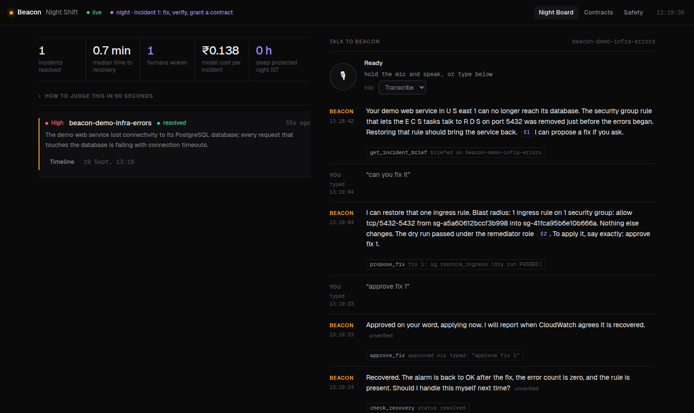
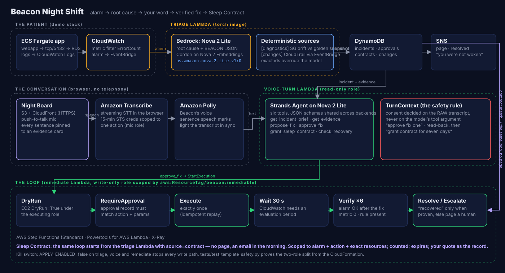

# Beacon Night Shift

**The on-call agent that fixes the 3 AM page with your voice — and the second time it happens, does not wake you at all.**

[](https://github.com/Prashant-thakur77/Beacon/actions/workflows/build.yaml)
[](https://github.com/Prashant-thakur77/Beacon/releases/latest)
[](LICENSE)
[](pyproject.toml)
[](docs/architecture.md)

**Live console:** http://beacon-console-283146810291-us-east-1.s3-website-us-east-1.amazonaws.com · **Demo film:** [YouTube](https://youtu.be/a3SxZHvIkCo) · [3-minute cut](https://github.com/Prashant-thakur77/Beacon/releases/download/v0.2.0/Beacon-Night-Shift-3min.mp4) · [full cut](https://github.com/Prashant-thakur77/Beacon/releases/download/v0.2.0/Beacon-Night-Shift-full.mp4) · **Blog:** [Why the transcript is the safety artifact](https://builder.aws.com/post/3Jb5v7ouXDReILJ7WMuHrlB1leL_p/why-transcript-is-the-safety-artifactvoice-approved-aws-remediation-with-strands-and-step-functions) · **Architecture:** [docs/architecture.md](docs/architecture.md) (Mermaid) · **Try it locally:** `make setup && make local`

It is 3 AM. Payments are failing. You are alone, half-asleep, phone in hand. You need four answers: *is it real, what changed, what do I do, can I go back to sleep.*

Beacon reads the logs on Amazon Bedrock, finds the CloudTrail change that caused the outage, proves it against a golden snapshot, proposes one allowlisted fix, dry-runs it under a locked-down role, and waits for your word. You say **"approve fix one"** into your browser. A Step Functions loop applies the fix and refuses to say *recovered* until CloudWatch agrees. Then Beacon asks: *handle this myself next time?* You say yes, for a week. That sentence becomes a **Sleep Contract**: a scoped, expiring standing approval, with your own words as the record. The next time the same thing breaks, Beacon fixes it, verifies it, and emails you in the morning. Zero humans woken.

Built solo in a weekend for the AWS *First Commit* hackathon. Everything below is live code with tests, not a slide.



## Try it in two minutes, no AWS account

```bash
make setup            # once: uv venv, CPU torch, the package, npm ci
make local            # console + FastAPI + in-process moto on http://localhost:8000
```

Open <http://localhost:8000/?night=1> (or press **▶ Run the night** on the board). Beacon types the engineer's lines for you: *can you fix it* → *approve fix 1* → *yes* → *grant contract for seven days*; then the same fault fires again and is fixed under the contract with **nobody woken**. Every tool call, dry run, verification and contract you see is the production code path against moto — only Bedrock is scripted.

---

## What it does, in one incident



```
CloudWatch alarm fires ──▶ Lambda (Nova 2 Lite on Bedrock)   RCA + change correlation
                            │  + Cordon / Nova Embeddings      (keeps the anomalous log sections)
                            │  + security-group drift check    (deterministic, exact resource ids)
                            │  + CloudTrail change ledger      (EventBridge-fed: what changed, by whom)
                            ▼
                     DynamoDB incident ──▶ Night Board (S3 + CloudFront)
                                                │
              you, in the browser ◀────────────▶ Strands agent on Nova 2 Lite
              (Transcribe streaming STT,          six tools · every sentence cites its evidence
               Polly TTS with speech marks)       "can you fix it?"  → propose_fix (dry run, blast radius)
                                                  "approve fix one"  → approve_fix (checked against YOUR transcript)
                                                                         │
                                                  Step Functions  DryRun → RequireApproval → Execute → Wait → Verify ×6
                                                  (write-only remediator role, tag-scoped IAM, idempotent)
                                                                         │
                                                  Resolved ⟵ alarm OK *after* the fix · error metric 0 · rule present
                                                  Escalate ⟵ anything else pages a human
              "handle this yourself next time?" → grant_sleep_contract (read-back, then the exact phrase)
```

The second incident under a contract runs the same loop with `source: contract` and sends the *"you were not woken"* email instead of a page.

## Where AWS fits

| Service / AWS open source | Role | Where |
|---|---|---|
| **Amazon Bedrock — Nova 2 Lite** | root-cause analysis; the voice agent's reasoning | `triage.py`, `voice_turn.py` |
| **Amazon Bedrock — Nova 2 Multimodal Embeddings** | semantic log reduction via Cordon | `analyzer.py` |
| **Strands Agents SDK** (AWS OSS) | the tool-calling voice agent | `voice_turn.py`, `voice_tools.py` |
| **Powertools for AWS Lambda** (AWS OSS) | Function URL routing, tracing | `voice_turn.py`, `dashboard_api.py` |
| **AWS Step Functions** | the verified remediation loop | `remediation-template.yaml`, `remediate.py` |
| **AWS CloudTrail → Amazon EventBridge** | change ledger: what changed before the alarm | `changes.py` |
| **Amazon Transcribe** (streaming) | speech to text in the browser, STS-scoped creds | `web/src/voice/transcribe.ts` |
| **Amazon Polly** | Beacon's voice, sentence speech marks for UI sync | `voice_turn.py` |
| **AWS Lambda** + Function URLs | triage, voice turn, remediate, change ledger, dashboard | all five functions |
| **Amazon DynamoDB** | incidents, approvals, contracts (TTL), change ledger, idempotency | `store.py`, `approvals.py`, `contracts.py` |
| **Amazon SNS** | pages, "not woken" emails, resolved / escalated | `notifier.py`, `remediate.py` |
| **Amazon S3 + CloudFront** | the Night Board console (HTTPS for the mic) | `console-template.yaml` |
| **Amazon CloudWatch** (alarms, metrics, logs) | the trigger and the verification oracle | `events.py`, `remediation/verify.py` |
| **Amazon EC2 / ECS / RDS** | the patient: a real Fargate app behind a security group | `demo/` |
| **AWS IAM** | two roles, one direction (see Safety) | all three templates |

## Safety model (the part that matters)

Auto-remediation is only worth shipping if it cannot do the wrong thing. Beacon's controls are in code and IAM, not in a prompt:

1. **Allowlist by code.** Exactly two actions exist: `sg.restore_ingress` and `ecs.force_redeploy` (`src/beacon/remediation/registry.py`). Params must match the schema exactly.
2. **Allowlist by data.** A security-group restore must exist in the *golden snapshot* taken on a healthy stack (`make snapshot-sg`).
3. **Dry run first, under the executing role.** EC2 only tells the truth about permissions to the caller that will execute, so `propose_fix` dry-runs through the remediator Lambda, and the loop dry-runs again before Execute.
4. **Consent is checked against your transcript, never the model's claim.** `approve_fix` reads the raw text of the current turn and requires the exact phrase `approve fix <n>` (`src/beacon/turn_context.py`). A Sleep Contract needs a read-back turn *and then* `grant contract for <n> days` (or the Hinglish equivalent); "yes" alone never grants.
5. **Executes exactly once.** The approval record is consumed atomically; retries replay the stored result.
6. **Two roles, one direction.** The agent you talk to has zero EC2/ECS write actions. The remediator role holds only the two allowlisted writes, scoped by `aws:ResourceTag/beacon:remediable=true` (plus the untaggable `security-group-rule/*` statement that trips everyone up). `tests/test_template_safety.py` parses the real CloudFormation and fails if this ever changes.
7. **Recovered means proven.** Verify requires all three: the alarm is `OK` *and its state changed after the execute time*, the alarm's own metric is at zero, and the action's post-condition holds. Anything else escalates to a human.
8. **Contracts are scoped and expire.** Alarm + action + exact resources, a use counter, a TTL, and your quote. Revoke from the console.
9. **One switch stops every write path.** `make apply-off` sets `APPLY_ENABLED=false` on the triage, voice and remediate functions.

Details: [`docs/safety.md`](docs/safety.md).

## Run it

### Locally, no AWS account (the *Build It* path)

```bash
git clone <this repo> && cd beacon
make setup            # uv venv + CPU torch + cordon (no CUDA) + the package with [agent,dev]; npm ci
make local            # builds the console, starts http://localhost:8000 (passcode: local)
```

Needs Python 3.12, [uv](https://docs.astral.sh/uv/) and Node 20. No Docker, no AWS credentials.

Open the URL, enter the passcode, and talk (or type): *what changed* → *can you fix it* → *approve fix 1* → *yes* → *grant contract for seven days*. Then `make local-break` in another terminal: the second outage is handled under the contract and the tally shows **0 humans woken** for it. `?night=1` does all of that for you. The AWS calls run against an in-process [moto](https://github.com/getmoto/moto); every safety check is the production code. Bedrock is replaced by a scripted agent.

### On AWS (the *Ship It* path)

Three stacks, one command each, all idempotent. Images are tagged with the git SHA and the deploy refuses a stale tag.

```bash
make deploy-demo                                   # the patient: VPC + RDS + Fargate app + alarm
make setup-image && make setup-agent-image         # triage image (torch), slim agent image
make deploy-remediation                            # tables, remediator role, Step Functions, change ledger
make deploy EMAIL=you@x.com LOG_GROUP_PATTERNS=/ecs/beacon-demo ENABLE_ALARM=true ALARM_NAME_PREFIX=beacon-demo TOKEN_BUDGET=6000 INCIDENTS_ENABLED=true
make snapshot-sg && make tag-remediable && make dry-run    # golden snapshot; must print DRY RUN PASSED
make set-passcode PASSCODE=<word> && make deploy-console   # S3 + CloudFront + voice/dashboard Lambdas
make break-demo                                    # revoke the RDS rule; the alarm fires in 2-3 min
```

Then open the console URL. Full runbook with expected outputs: [`docs/human-runbook.md`](docs/human-runbook.md). The same steps run from GitHub Actions: **Actions → Deploy → Run workflow** (`.github/workflows/deploy.yaml`, OIDC role + passcode as secrets).

New AWS accounts sit under a verification hold for a while: CloudFront and Bedrock refuse to create/serve until it clears. `make deploy-console USE_CLOUDFRONT=false` serves the console from S3 website hosting in the meantime (HTTP, typed input; flip the flag back for HTTPS and the mic). Prerequisites: Bedrock model access for Nova 2 Lite and Nova 2 Multimodal Embeddings, and a CloudTrail trail in the region (the change ledger listens to EventBridge).

Operator shortcuts: `make propose`, `make approve FIX=1`, `make replay-approval APPROVAL=<id>` (proves idempotency), `make demo-reset`, `make demo-sleep` (a real second outage), `make demo-rehearse` (the whole cycle unattended), `make apply-off`.

## Repository map

```
src/beacon/
  handler.py            triage Lambda: logs → Cordon → Nova 2 Lite → RCA; diagnostics + change sources; Sleep Contract branch
  rca.py                parser for the RCA text contract (STATUS … BEACON_JSON)
  diagnose.py           security-group drift vs golden snapshot → exact params for the fix
  changes.py            CloudTrail change ledger (EventBridge Lambda + query side)
  store.py / approvals.py / contracts.py   DynamoDB: incidents, approvals, Sleep Contracts
  remediation/          registry (the allowlist), actions_sg, actions_ecs, verify (three checks)
  remediate.py          remediate Lambda: dryrun · require_approval · execute · verify · resolve · escalate · all
  voice_tools.py        six tools + TOOL_SCHEMAS (shared across voice backends)
  turn_context.py       the raw transcript of the current turn; consent is decided here
  voice_turn.py         Function URL: /session (STS mic creds), /turn (Strands agent + Polly), tool_only
  voice_loop.py         litellm fallback engine, same tools
  dashboard_api.py      read-only Function URL for the console (redacts account ids / ARNs); GET /analytics aggregates nights, recovery percentiles, cost
  observability.py      Powertools EMF metrics + X-Ray spans, one dimension set, incident id as metadata
  aws.py                boto3 clients with bounded timeouts and retries
web/                    Vite + React console: Night Board, Talk, Analytics, Contracts, Safety, replay, "Run the night"
template.yaml           base stack (triage)          remediation-template.yaml   console-template.yaml
demo/                   the patient: VPC + RDS + Fargate app + alarm, and the sticky-wedge failure mode
requirements/           pinned image dependencies (triage.txt, agent.txt)
scripts/                gate.sh · commit.sh · local_server.py (make local) · preflight, capture, replay builders
tests/                  244 tests: moto for AWS, FakeAgent for the model, template safety + ops, local mode
docs/                   architecture.md (Mermaid) · safety.md · human-runbook.md · demo-script.md · submission.md · blog.md · LEARNINGS.md
video/                  how the demo film is generated (Chatterbox narration, three.js scenes, Playwright captures, ffmpeg)
.github/                CI (gate + console build), manual Deploy workflow, issue/PR templates
```

## Development

```bash
make help                # every target, one line each
bash scripts/gate.sh     # ruff format/check, mypy --strict, cfn-lint, pytest, web tsc
bash scripts/commit.sh "message"   # gate, then commit (refuses on red)
cd web && npm run dev    # console against a running `make local`
```

Tests are the spec. The safety model is asserted from the real CloudFormation ([`tests/test_template_safety.py`](tests/test_template_safety.py)), the operational claims from the same files ([`tests/test_template_ops.py`](tests/test_template_ops.py)), and the whole product runs against moto in [`tests/test_local_server.py`](tests/test_local_server.py). CI runs the gate and builds the console on every push.

## Production notes

What "production grade" means here, and where each claim is enforced:

| Concern | Where |
|---|---|
| Public endpoints fail closed: constant-time passcode compare, 401 when the passcode is unset, 2 000-char text limit, incident ids validated | `voice_turn.py`, `tests/test_hardening.py` |
| Every AWS call has a connect/read timeout and bounded retries, so a hung Polly or STS call leaves room for the fallback inside the 45 s turn | `src/beacon/aws.py` |
| A failed Execute is recorded as the approval's result, so a Lambda retry replays it instead of running the action twice | `remediate.py`, `tests/test_hardening.py` |
| CORS is set once, on the Function URLs, and only for the console origin | `console-template.yaml`, `tests/test_template_ops.py` |
| CloudFront sends HSTS, `nosniff`, `X-Frame-Options: DENY` and a CSP that names every origin the console talks to (Function URLs, Transcribe streaming, AssemblyAI) | `BeaconConsoleHeaders` |
| Every Lambda logs JSON to a named group with 14-day retention (`/beacon/<stack>/{triage,remediate,changes,voice-turn,dashboard}`); EMF metrics carry the incident id as metadata | `LoggingConfig` in all three templates |
| Lambda `Errors` on every function, and the `Escalated` metric, page the SNS topic | `*ErrorsAlarm`, `BeaconEscalatedAlarm` |
| Reserved concurrency caps the public voice/dashboard functions and the privileged remediator | `ReservedConcurrentExecutions` |
| All four tables have point-in-time recovery and TTLs | `remediation-template.yaml` |
| The demo database password is generated and rotated by RDS in Secrets Manager; the task reads it as an ECS secret, never as an env var | `demo/demo-infra-template.yaml` |
| The dashboard list is cached for 2 s per container, so many viewers polling every 3 s cost one scan | `dashboard_api._all_incidents` |
| The console times out reads at 10 s, backs off polling (x2, max 60 s) on errors, pauses polling in hidden tabs, and catches render errors in a boundary | `web/src/api.ts`, `hooks.ts`, `components/ErrorBoundary.tsx` |
| Container image tags are the git SHA of the last source change; deploy targets refuse a stale or dirty tag | `scripts/image_tag.sh`, `scripts/check_image_tag.sh` |
| Image dependencies are pinned to the versions the suite ran against; a test fails if the pins drift a minor version from the environment | `requirements/*.txt`, `tests/test_hardening.py` |

Known gaps, on purpose for a hackathon: a single passcode instead of per-user identity (Cognito would replace `_passcode_ok` in one place), no WAF in front of the Function URLs (reserved concurrency is the blast-radius limit), and the demo RDS has no backups.

## License

Apache 2.0.
