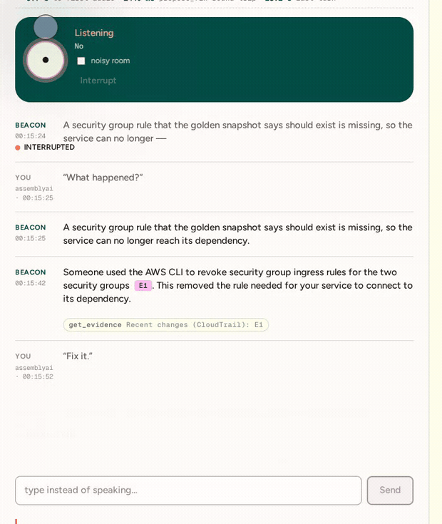
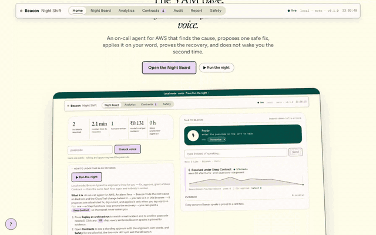
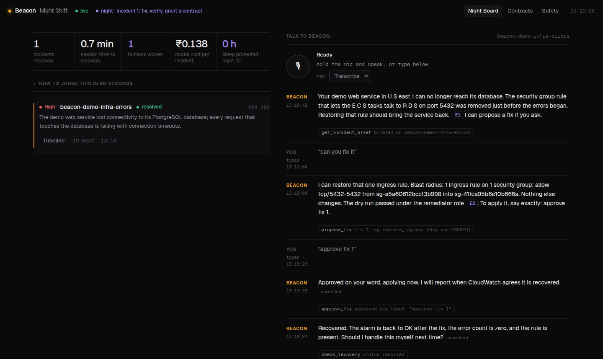
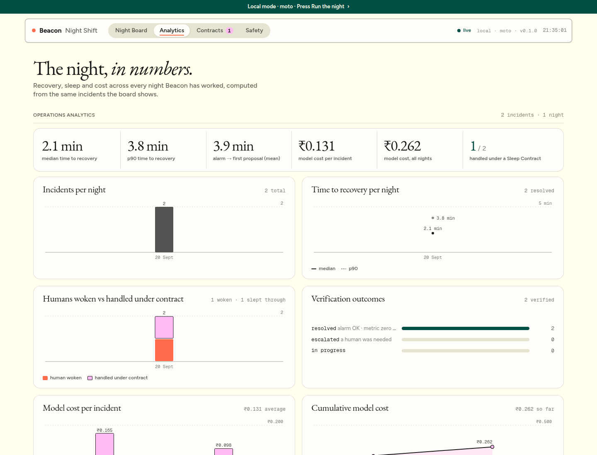
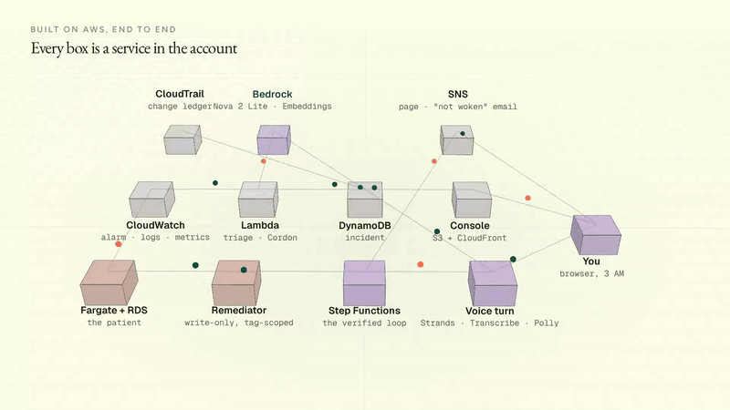
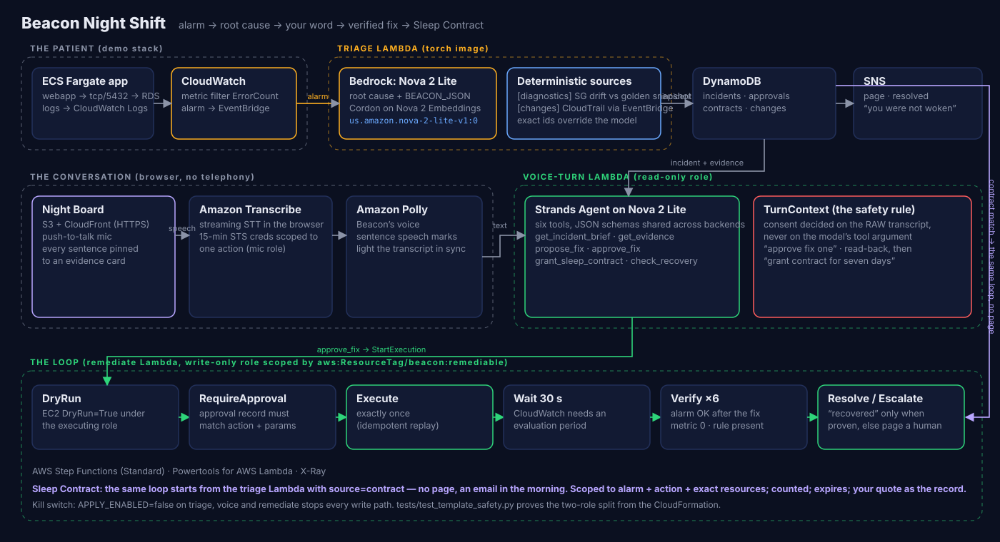
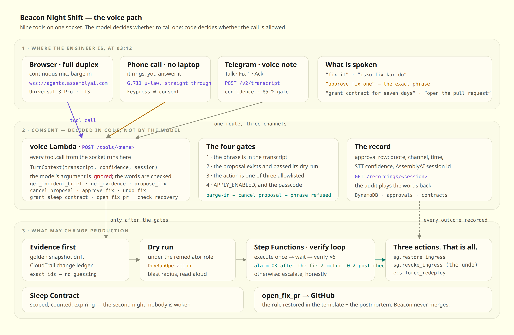

# Beacon Night Shift

**The on-call agent that fixes the 3 AM page with your voice — and the second time it happens, does not wake you at all.**

*It holds write access to production, and the only thing that unlocks it is a sentence AssemblyAI heard you say.*

[](https://github.com/Prashant-thakur77/Beacon/actions/workflows/build.yaml)
[](https://github.com/Prashant-thakur77/Beacon/releases/latest)
[](LICENSE)
[](pyproject.toml)
[](docs/architecture.md)

**Live console:** https://6die6lduac6ipxkeg73nxsuvpu0yzkim.lambda-url.us-east-1.on.aws/ · **Film (4:44):** [download](https://github.com/Prashant-thakur77/Beacon/releases/download/v0.6.0/Beacon-AssemblyAI.mp4) · **Deck:** [PDF](https://github.com/Prashant-thakur77/Beacon/releases/download/v0.6.0/Beacon-deck.pdf) · **Architecture:** [the voice path](#architecture) · **Business case:** [docs/business-case.md](docs/business-case.md) · **Built on AssemblyAI:** [the transcript is the authorisation](#built-on-assemblyai--the-transcript-is-the-authorisation) · **Try it locally, no AWS:** `make setup && make local`

It is 3 AM. Payments are failing. You are alone, half-asleep, phone in hand. You need four answers — *is it real, what changed, what do I do, can I go back to sleep* — and today's tools answer, at most, the first one.

Beacon finds the CloudTrail change behind the alarm, proves it against a golden snapshot of the security groups, proposes exactly one allowlisted fix and dry-runs it under a locked-down role. Then it waits for your voice. You say **"approve fix one"**; those words — the ones AssemblyAI actually transcribed, not an argument a model wrote — are what unlock the change. A Step Functions loop applies it and refuses to say *recovered* until CloudWatch agrees. You say **"grant contract for seven days"**, and the next time the same fault fires it is fixed while you sleep. You say **"open the pull request"**, and the rule is restored in the CloudFormation template with the postmortem attached — because the alarm clearing was never the end of the incident.

> ### Judge this in 90 seconds
>
> 1. **With a microphone** — open the [live console](https://6die6lduac6ipxkeg73nxsuvpu0yzkim.lambda-url.us-east-1.on.aws/), enter the passcode from the submission, press **Connect** and say *"what happened"*, then *"fix it"*. **Interrupt the read-back while it speaks** — the fix is withdrawn and the approval phrase stops working. Say *"fix it"* again, then *"approve fix two"*, and watch the verify loop.
> 2. **Without a microphone** — press **▶ Run the night** on the board, or open `?night=1`. The whole night plays unattended.
> 3. **The thirty seconds that matter** — in the film at **1:50**: an approval heard at 75 % is refused, heard again at 74 % and refused again, and typed instead. Nothing reached production until the words were certain. That was not staged.
> 3. **Without an AWS account** — `make setup && make local`, same thing on your laptop against in-process moto.
> 4. **The proof** — the *Audit* page plays back the **session recording** behind every approval; [PR #2](https://github.com/Prashant-thakur77/beacon-demo-infra/pull/2) is a pull request Beacon opened by voice.

<table><tr>
<td width="52%"></td>
<td><b>Interrupt it, and the fix is withdrawn.</b><br/><br/>
A real run on the deployed account. Beacon is reading the blast radius back; the engineer speaks over it.
The reply is marked <i>interrupted</i>, <code>cancel_proposal</code> runs, and the console says
<i>“Fix 1 withdrawn — you spoke over the read-back, so nothing was applied.”</i><br/><br/>
Saying <code>approve fix 1</code> now is refused: the proposal is gone until it is proposed again.
Turn-taking, with a safety meaning.<br/><br/>
<sub>Test: <code>tests/test_voice_tools.py::test_cancel_proposal_withdraws_the_pending_fix</code></sub></td>
</tr></table>



<table><tr>
<td></td>
<td></td>
</tr><tr>
<td align="center"><sub>Night Board: the incident, the conversation, the evidence</sub></td>
<td align="center"><sub>Analytics: recovery, sleep and cost across nights</sub></td>
</tr></table>

## Try it in two minutes, no AWS account

```bash
make setup            # once: uv venv, CPU torch, the package, npm ci
make local            # console + FastAPI + in-process moto on http://localhost:8000
```

Open <http://localhost:8000/?night=1> (or press **▶ Run the night** on the board). Beacon types the engineer's lines for you: *can you fix it* → *approve fix 1* → *yes* → *grant contract for seven days*; then the same fault fires again and is fixed under the contract with **nobody woken**. Every tool call, dry run, verification and contract you see is the production code path against moto — only Bedrock is scripted.

---

## What it does, in one incident



<details><summary>Static diagram</summary>



</details>

```
CloudWatch alarm fires ──▶ Lambda (Nova 2 Lite on Bedrock)   RCA + change correlation
                            │  + Cordon / Nova Embeddings      (keeps the anomalous log sections)
                            │  + security-group drift check    (deterministic, exact resource ids)
                            │  + CloudTrail change ledger      (EventBridge-fed: what changed, by whom)
                            ▼
                     DynamoDB incident ──▶ Night Board (S3 + CloudFront)
                                                │
              you, in the browser ◀────────────▶ Strands agent on Nova 2 Lite
              (Transcribe streaming STT,          seven tools · every sentence cites its evidence
               Polly TTS with speech marks)       "can you fix it?"  → propose_fix (dry run, blast radius)
                                                  "approve fix one"  → approve_fix (checked against YOUR transcript)
                                                                         │
                                                  Step Functions  DryRun → RequireApproval → Execute → Wait → Verify ×6
                                                  (write-only remediator role, tag-scoped IAM, idempotent)
                                                                         │
                                                  Resolved ⟵ alarm OK *after* the fix · error metric 0 · rule present
                                                  Escalate ⟵ anything else pages a human
              "handle this yourself next time?" → grant_sleep_contract (read-back, then the exact phrase)
```

The second incident under a contract runs the same loop with `source: contract` and sends the *"you were not woken"* email instead of a page.

## Architecture

<picture>
  <source media="(prefers-color-scheme: dark)" srcset="docs/assets/architecture-voice.png" />
  
</picture>

Three planes, and the middle one is the product: **the model decides whether to call a tool; code decides whether the call is allowed.** A full description is in [docs/architecture.md](docs/architecture.md); the safety argument is in [docs/safety.md](docs/safety.md).

## Where AWS fits

| Service / AWS open source | Role | Where |
|---|---|---|
| **Amazon Bedrock — Nova 2 Lite** | root-cause analysis; the voice agent's reasoning | `triage.py`, `voice_turn.py` |
| **Amazon Bedrock — Nova 2 Multimodal Embeddings** | semantic log reduction via Cordon | `analyzer.py` |
| **Strands Agents SDK** (AWS OSS) | the tool-calling voice agent | `voice_turn.py`, `voice_tools.py` |
| **Powertools for AWS Lambda** (AWS OSS) | Function URL routing, tracing | `voice_turn.py`, `dashboard_api.py` |
| **AWS Step Functions** | the verified remediation loop | `remediation-template.yaml`, `remediate.py` |
| **AWS CloudTrail → Amazon EventBridge** | change ledger: what changed before the alarm | `changes.py` |
| **Amazon Transcribe** (streaming) | speech to text in the browser, STS-scoped creds | `web/src/voice/transcribe.ts` |
| **Amazon Polly** | Beacon's voice, sentence speech marks for UI sync | `voice_turn.py` |
| **AWS Lambda** + Function URLs | triage, voice turn, remediate, change ledger, dashboard | all five functions |
| **Amazon DynamoDB** | incidents, approvals, contracts (TTL), change ledger, idempotency | `store.py`, `approvals.py`, `contracts.py` |
| **Amazon SNS** | pages, "not woken" emails, resolved / escalated | `notifier.py`, `remediate.py` |
| **Amazon S3 + CloudFront** (or a Lambda Function URL proxy while a new account is under verification) | the Night Board console over HTTPS | `console-template.yaml`, `static_site.py` |
| **Amazon CloudWatch** (alarms, metrics, logs) | the trigger and the verification oracle | `events.py`, `remediation/verify.py` |
| **Amazon EC2 / ECS / RDS** | the patient: a real Fargate app behind a security group | `demo/` |
| **AWS IAM** | two roles, one direction (see Safety) | all three templates |

## Built on AssemblyAI — the transcript *is* the authorisation

Beacon is not a voice interface bolted onto a tool. **The words are the artifact a change to production is justified by**, afterwards, to somebody who was not in the room — and every property of that artifact comes from AssemblyAI:

- **what unlocked the change** — the exact phrase, checked against the transcript and never against the model's argument;
- **how clearly it was heard** — per-word confidence, and a change approved below 85 % is refused or flagged;
- **who said it** — the caller's own channel on a phone call, not an inference about speakers;
- **and the recording**, so anybody can play the words back a week later.

Take AssemblyAI out and you do not lose the voice interface. You lose the audit — and the audit is the reason this can hold a credential at all.

The clearest demonstration is in the film, and nobody scripted it: an approval came back at **75 %** and was refused, came back again at **74 %** and was refused again, and the engineer typed it instead. Nothing reached production until the words were certain. The thing that stopped a change to a live AWS account was a confidence number from a transcription model.

The console's default voice path is the Voice Agent API; the AWS cascade (Transcribe → Nova → Polly) stays one toggle away for the side-by-side. Each AssemblyAI API is used where it fits, not everywhere:

| AssemblyAI API | What it does here | Where |
|---|---|---|
| **Voice Agent API** (`wss://agents.assemblyai.com/v1/ws`) | Full duplex in the browser: Universal-3 Pro STT, turn detection, barge-in, the managed LLM, TTS, and the nine Beacon tools declared as client-side functions — every `tool.call` comes back to the browser, which runs it on the voice Lambda with the transcript the API produced. English and Hinglish in and out. | `web/src/voice/assemblyai.ts`, `voice_turn.py` (`POST /tools/<name>`) |
| **Voice Agent API, on a telephone line** (`audio/pcmu`) | The same socket, the same nine tools, with a phone call on the other side instead of a laptop. The API takes **G.711 µ-law natively**, and a phone line is µ-law already, so the carrier's frames are forwarded **untouched in both directions** — no resampling, no transcoding. Turn detection is loosened for a noisy line and the agent is told there is no screen. An engineer in bed reaches the same agent, under the same consent rules. | `beacon/phone/` ([docs/phone.md](docs/phone.md)) |
| **Pre-recorded transcription** (`/v2/transcript`, language detection, `keyterms_prompt`) | Telegram voice notes: the file is uploaded from the Lambda, transcribed with **word-level confidence**, and a mumbled "approve fix one" is refused with the confidence it was heard at. | `telegram.py`, `telegram_bot.py` |
| **Dual-channel transcription** (`dual_channel`) | The agent reads the approval phrase back, so it is in the recording twice — once from each party. A phone call is recorded with the caller on one channel and the agent on the other, and every utterance is labelled by channel, so **the sentence that changed production is attributable to the human** without inferring speakers. A change whose phrase appears only on the agent's channel fails the check. | `aai.py` (`transcribe_call`), `beacon/phone/attest.py` |
| **Session recordings** (`GET /v1/sessions/{id}`) | Every approval and contract made in a live session stores the session id; the audit page plays the recording behind the quote (**▶ Listen**), and the postmortem cites it. | `voice_turn.py` (`GET /recordings/<id>`), `web/src/components/Reports.tsx` |
| **Summarization** (`summary_model: conversational`) | *"Summarise the session"* on an audit row: AssemblyAI transcribes its own recording of the conversation and summarises it, redacted; the result is kept on the incident and printed in the postmortem as **the night in the engineer's words**. | `aai.py`, `voice_turn.py` (`POST /sessions/<id>/summary`) |
| **PII redaction** (`redact_pii`, hashed) | A voice note at 3 AM can carry a colleague's name or a customer's number. Consent is checked against the words as heard, in memory; what is *written* to the approval row, the audit and the pull request is the redacted text. | `telegram.py`, `voice_tools.py` (`_quote`) |
| **Word-level confidence on every channel** (`/v2/transcript`, `words[].confidence`) | A live turn carries **no** confidence — `transcript.user` has text and no number — so a browser or phone approval was applied without one, while the same words on Telegram had to clear 85 %. AssemblyAI now re-transcribes **its own recording of the session** afterwards, and each phrase that unlocked a change is scored by its **weakest word**; a poor score is flagged in the audit. One standard, whichever channel carried the words. | `aai.py` (`audit_session`), `phone/attest.py`, `voice_turn.py` (`POST /sessions/<id>/attest`) |
| Temporary tokens (`GET /v1/token`) | The browser never sees the API key; the Lambda mints a 10-minute token per session. | `voice_turn.py` (`POST /assemblyai/token`) |

Three behaviours the socket makes possible, each with a test or a harness run behind it: **barge-in withdraws the fix** (`cancel_proposal`, the interrupted read-back cannot be approved), **drop-safety** (an approval spoken before the socket dies never executes — execution is a Lambda call after `tool.call`, never socket state), and **the night ends with a pull request** (`open the pull request` → `open_fix_pr` restores the rule in the CloudFormation template and files the postmortem; nothing is merged). Details and measured latencies: [docs/assemblyai.md](docs/assemblyai.md); the plan: [docs/assemblyai-roadmap.md](docs/assemblyai-roadmap.md); Telegram: [docs/telegram.md](docs/telegram.md); the PR: [docs/fix-at-source.md](docs/fix-at-source.md).

## Two faults, three actions, one allowlist

Beacon answers two kinds of night, and refuses the rest:

| What is wrong | How it is found | What it proposes |
|---|---|---|
| A security-group rule vanished | golden-snapshot drift + the CloudTrail change that took it | `sg.restore_ingress` with the exact ids — a diagnosis |
| A service is short of tasks, or its deployment failed | `describe-services` against the remediable allowlist | `ecs.force_redeploy` with the reason |
| Nothing explains the alarm, one service is restartable | everything else came back clean | a **last-resort restart**, and it says so: *"a remedy, not a diagnosis"* |
| Anything else | — | nothing. It escalates to a human and says why |

Each proposal is dry-run under the executor role, gated on your spoken phrase, and verified afterwards — with a **budget that fits the action**: a restored rule proves itself in a minute, a replaced task gets eight. That last number came from a live run where Beacon escalated a restart that had actually worked.

## Tests that speak

Unit tests prove the tools are safe. They cannot prove that *saying* something runs the right tool,
that agreement is not consent, or that interrupting a read-back really withdraws a fix — those
properties live in speech and turn-taking.

```bash
make local && make voice-test        # six spoken scenarios in the browser path
make local && make phone-test        # five scripted calls down a telephone line
```

Each scenario renders the engineer's lines with Polly, streams them into the **AssemblyAI Voice
Agent API** as microphone audio, runs every resulting `tool.call` against the local Beacon exactly
as the browser would, and asserts on what was heard, which tools ran, and how the incident ended.

| Scenario | The property it defends |
|---|---|
| `approve` | the exact phrase applies the fix and the verify loop starts |
| `wrong_phrase` | *"yes, do it"* changes **nothing** — agreement is not consent |
| `barge_in` | speaking over the read-back withdraws the proposal; nothing executes after |
| `hinglish` | *"isko fix kar do"* reaches the same tool as *"fix it"* |
| `contract` | a Sleep Contract needs the read-back **and** then the exact phrase |
| `undo` | an applied fix can be reversed by phrase |

Writing it was not ceremony. It found a non-idempotent `local/break`, a first-word clip that made
the server (correctly) refuse a grant, the fact that the fix number is not always one — and one
genuine surprise: a **Sleep Contract granted by an earlier scenario silently fixed the next
scenario's incident**, with no phrase and nobody woken, exactly as designed. Five or six of the six
pass on a given run; the one that flakes is almost always a misheard line, not the agent. Details,
including what it is *not*: [docs/voice-testing.md](docs/voice-testing.md).

## Who it is for, and what it is worth

**A backend engineer on a team of one to five, running production on AWS for users in another time zone** — a four-person startup in Bengaluru serving New York, the single DevOps hire at a 30-person SaaS. No follow-the-sun rotation, no second shift, a handful of faults that keep repeating.

Industry MTTR is **53 minutes** and has improved 12 % in five years against a tripling of monitoring spend; **74 %** of DevOps engineers report burnout, with on-call load the leading indicator. On the live account a real alarm reaches a **verified** recovery in **2.4–5.5 minutes** without a laptop being opened — and under a Sleep Contract the repeat fault is fixed with **nobody woken**.

Market, pricing and the reason this needed this generation of models: [docs/business-case.md](docs/business-case.md).

## Safety model (the part that matters)

Auto-remediation is only worth shipping if it cannot do the wrong thing. Beacon's controls are in code and IAM, not in a prompt:

1. **Allowlist by code.** Exactly three actions exist: `sg.restore_ingress`, its inverse `sg.revoke_ingress` ("undo fix 1", only for a rule Beacon itself restored) and `ecs.force_redeploy` (`src/beacon/remediation/registry.py`). Params must match the schema exactly.
2. **Allowlist by data.** A security-group restore must exist in the *golden snapshot* taken on a healthy stack (`make snapshot-sg`).
3. **Dry run first, under the executing role.** EC2 only tells the truth about permissions to the caller that will execute, so `propose_fix` dry-runs through the remediator Lambda, and the loop dry-runs again before Execute.
4. **Consent is checked against your transcript, never the model's claim.** `approve_fix` reads the raw text of the current turn and requires the exact phrase `approve fix <n>` (`src/beacon/turn_context.py`). A Sleep Contract needs a read-back turn *and then* `grant contract for <n> days` (or the Hinglish equivalent); "yes" alone never grants.
5. **Executes exactly once.** The approval record is consumed atomically; retries replay the stored result.
5b. **Undo is a first-class action.** `undo fix <n>` runs the fix's inverse through the same dry run, approval record and single execute, only for a fix Beacon itself applied; the incident goes back to awaiting a human.
6. **Two roles, one direction.** The agent you talk to has zero EC2/ECS write actions. The remediator role holds only the two allowlisted writes, scoped by `aws:ResourceTag/beacon:remediable=true` (plus the untaggable `security-group-rule/*` statement that trips everyone up). `tests/test_template_safety.py` parses the real CloudFormation and fails if this ever changes.
7. **Recovered means proven.** Verify requires all three: the alarm is `OK` *and its state changed after the execute time*, the alarm's own metric is at zero, and the action's post-condition holds. Anything else escalates to a human.
8. **Contracts are scoped and expire.** Alarm + action + exact resources, a use counter, a TTL, and your quote. Revoke from the console.
9. **Undo by phrase.** Every fix has an allowlisted inverse (`sg.revoke_ingress`); saying `undo fix 1` reverses exactly what Beacon applied, records it in the audit, and hands the incident back to you. Pages reach you where you are: Slack, PagerDuty and Telegram, deep-linked to `#board/<incident_id>`.
10. **A keypress is never consent.** On a phone call, DTMF can acknowledge (`1`), re-brief (`2`), repeat (`0`) or hang up (`9`); it can never approve, undo, grant a contract or open a pull request, and pressing any other key makes the agent say so. An approval has to be words somebody can be held to. Only the caller's microphone is ever streamed to the transcriber, so the transcript the consent check reads cannot contain the agent reading a phrase back to itself — and the two-channel recording lets anyone else verify that afterwards. See [docs/phone.md](docs/phone.md).
11. **Telegram voice notes.** The page lands in your Telegram chat with *Talk · Fix 1 · Ack* buttons; you answer with a voice note in English or Hinglish. AssemblyAI's pre-recorded API transcribes it with word-level confidence, the same phrase router runs the same tools, and a mumbled `approve fix one` is refused with the confidence it was heard at. See [docs/telegram.md](docs/telegram.md).
12. **One switch stops every write path.** `make apply-off` sets `APPLY_ENABLED=false` on the triage, voice and remediate functions.

Details: [`docs/safety.md`](docs/safety.md).

## Run it

### Locally, no AWS account (the *Build It* path)

```bash
git clone <this repo> && cd beacon
make setup            # uv venv + CPU torch + cordon (no CUDA) + the package with [agent,dev]; npm ci
make local            # builds the console, starts http://localhost:8000 (passcode: local)
```

Needs Python 3.12, [uv](https://docs.astral.sh/uv/) and Node 20. No Docker, no AWS credentials.

Open the URL, enter the passcode, and talk (or type): *what changed* → *can you fix it* → *approve fix 1* → *yes* → *grant contract for seven days*. Then `make local-break` in another terminal: the second outage is handled under the contract and the tally shows **0 humans woken** for it. `?night=1` does all of that for you. The AWS calls run against an in-process [moto](https://github.com/getmoto/moto); every safety check is the production code. Bedrock is replaced by a scripted agent.

### On AWS (the *Ship It* path)

Three stacks, one command each, all idempotent. Images are tagged with the git SHA and the deploy refuses a stale tag.

```bash
make deploy-demo                                   # the patient: VPC + RDS + Fargate app + alarm
make setup-image && make setup-agent-image         # triage image (torch), slim agent image
make deploy-remediation                            # tables, remediator role, Step Functions, change ledger
make deploy EMAIL=you@x.com LOG_GROUP_PATTERNS=/ecs/beacon-demo ENABLE_ALARM=true ALARM_NAME_PREFIX=beacon-demo TOKEN_BUDGET=6000 INCIDENTS_ENABLED=true
make snapshot-sg && make tag-remediable && make dry-run    # golden snapshot; must print DRY RUN PASSED
make set-passcode PASSCODE=<word> && make deploy-console   # S3 + CloudFront + voice/dashboard Lambdas
make break-demo                                    # revoke the RDS rule; the alarm fires in 2-3 min
```

Then open the console URL. Full runbook with expected outputs: [`docs/human-runbook.md`](docs/human-runbook.md). The same steps run from GitHub Actions: **Actions → Deploy → Run workflow** (`.github/workflows/deploy.yaml`, OIDC role + passcode as secrets).

New AWS accounts sit under a verification hold for a while: CloudFront and Bedrock refuse to create/serve until it clears. `make deploy-console USE_CLOUDFRONT=false` serves the console from S3 website hosting in the meantime (HTTP, typed input; flip the flag back for HTTPS and the mic). Prerequisites: Bedrock model access for Nova 2 Lite and Nova 2 Multimodal Embeddings, and a CloudTrail trail in the region (the change ledger listens to EventBridge).

Paging channels: pass `WEBHOOK_URL=<Slack-compatible incoming webhook>` and/or `PAGERDUTY_ROUTING_KEY=<Events v2 key>` to `make deploy`, `make deploy-remediation` and `make deploy-console` (Telegram: `make set-telegram-token …` then the same three deploys and `make set-telegram-webhook`, see [docs/telegram.md](docs/telegram.md)); every page, contract run, resolution, escalation, undo and morning report is posted with a deep link to the incident (PagerDuty incidents open on a page and close on resolution).

Operator shortcuts: `make propose`, `make approve FIX=1`, `make replay-approval APPROVAL=<id>` (proves idempotency), `make demo-reset`, `make demo-sleep` (a real second outage), `make demo-rehearse` (the whole cycle unattended), `make apply-off`.

## Repository map

```
src/beacon/
  handler.py            triage Lambda: logs → Cordon → Nova 2 Lite → RCA; diagnostics + change sources; Sleep Contract branch
  rca.py                parser for the RCA text contract (STATUS … BEACON_JSON)
  diagnose.py           security-group drift vs golden snapshot → exact params for the fix
  changes.py            CloudTrail change ledger (EventBridge Lambda + query side)
  store.py / approvals.py / contracts.py   DynamoDB: incidents, approvals, Sleep Contracts
  remediation/          registry (the allowlist), actions_sg, actions_ecs, verify (three checks)
  remediate.py          remediate Lambda: dryrun · require_approval · execute · verify · resolve · escalate · all
  voice_tools.py        nine tools + TOOL_SCHEMAS (shared across voice backends): brief, evidence, propose, approve, cancel, undo, contract, PR, recovery
  turn_context.py       the raw transcript of the current turn + attestation (confidence, session, file); consent is decided here
  voice_turn.py         Function URL: /tools/<name> (AssemblyAI path), /brief/<id>, /assemblyai/token, /recordings/<id>, /telegram/webhook, /session + /turn (AWS cascade)
  voice_brief.py        one session brief for every channel: prompt, greeting, key terms, tools
  phone/                the telephone channel: codec.py (G.711 + resampling), bridge.py (the
                        socket pump), attest.py (which channel approved), providers/ (Twilio,
                        and a replay leg that needs no carrier)
  telegram.py           Telegram outbound (pages with buttons), pre-recorded STT, Polly voice notes, the phrase router
  telegram_bot.py       Telegram inbound: one update → one tool → one reply (secret + allowlist)
  fix_pr.py             fix at the source: deterministic template patch + postmortem → GitHub pull request
  channels.py           fan-out of every page/resolution/undo/report to Slack-compatible webhooks, PagerDuty, Telegram
  reports.py            postmortem, audit rows/CSV, morning report (rendered from the record, no model)
  voice_loop.py         litellm fallback engine, same tools
  dashboard_api.py      read-only Function URL for the console (redacts account ids / ARNs); GET /analytics aggregates nights, recovery percentiles, cost
  observability.py      Powertools EMF metrics + X-Ray spans, one dimension set, incident id as metadata
  aws.py                boto3 clients with bounded timeouts and retries
web/                    Vite + React console: Night Board, Talk (full duplex on AssemblyAI + AWS cascade), Analytics, Contracts, Audit (with recordings), Safety, replay
template.yaml           base stack (triage)          remediation-template.yaml   console-template.yaml
demo/                   the patient: VPC + RDS + Fargate app + alarm, and the sticky-wedge failure mode
requirements/           pinned image dependencies (triage.txt, agent.txt)
scripts/                gate.sh · commit.sh · local_server.py (make local) · dev/assemblyai_loop.py + dev/assemblyai_audio.py (voice harnesses) · capture, replay builders
tests/                  371 tests: moto for AWS, FakeAgent for the model, fake Telegram/GitHub/AssemblyAI, template safety + ops, local mode
docs/                   architecture.md (Mermaid) · safety.md · assemblyai.md · telegram.md · fix-at-source.md · human-runbook.md · submission.md · blog.md
video/                  how the demo film is generated (Chatterbox narration, three.js scenes, Playwright captures, ffmpeg)
.github/                CI (gate + console build), manual Deploy workflow, issue/PR templates
```

## Development

```bash
make help                # every target, one line each
bash scripts/gate.sh     # ruff format/check, mypy --strict, cfn-lint, pytest, web tsc
bash scripts/commit.sh "message"   # gate, then commit (refuses on red)
cd web && npm run dev    # console against a running `make local`
```

Tests are the spec. The safety model is asserted from the real CloudFormation ([`tests/test_template_safety.py`](tests/test_template_safety.py)), the operational claims from the same files ([`tests/test_template_ops.py`](tests/test_template_ops.py)), and the whole product runs against moto in [`tests/test_local_server.py`](tests/test_local_server.py). CI runs the gate and builds the console on every push.

## Production notes

What "production grade" means here, and where each claim is enforced:

| Concern | Where |
|---|---|
| Public endpoints fail closed: constant-time passcode compare, 401 when the passcode is unset, 2 000-char text limit, incident ids validated | `voice_turn.py`, `tests/test_hardening.py` |
| Every AWS call has a connect/read timeout and bounded retries, so a hung Polly or STS call leaves room for the fallback inside the 45 s turn | `src/beacon/aws.py` |
| A failed Execute is recorded as the approval's result, so a Lambda retry replays it instead of running the action twice | `remediate.py`, `tests/test_hardening.py` |
| CORS is set once, on the Function URLs, and only for the console origin | `console-template.yaml`, `tests/test_template_ops.py` |
| CloudFront sends HSTS, `nosniff`, `X-Frame-Options: DENY` and a CSP that names every origin the console talks to (Function URLs, Transcribe streaming, AssemblyAI) | `BeaconConsoleHeaders` |
| Every Lambda logs JSON to a named group with 14-day retention (`/beacon/<stack>/{triage,remediate,changes,voice-turn,dashboard}`); EMF metrics carry the incident id as metadata | `LoggingConfig` in all three templates |
| Lambda `Errors` on every function, and the `Escalated` metric, page the SNS topic | `*ErrorsAlarm`, `BeaconEscalatedAlarm` |
| Reserved concurrency caps the public voice/dashboard functions and the privileged remediator | `ReservedConcurrentExecutions` |
| All four tables have point-in-time recovery and TTLs | `remediation-template.yaml` |
| The demo database password is generated and rotated by RDS in Secrets Manager; the task reads it as an ECS secret, never as an env var | `demo/demo-infra-template.yaml` |
| The dashboard list is cached for 2 s per container, so many viewers polling every 3 s cost one scan | `dashboard_api._all_incidents` |
| The console times out reads at 10 s, backs off polling (x2, max 60 s) on errors, pauses polling in hidden tabs, and catches render errors in a boundary | `web/src/api.ts`, `hooks.ts`, `components/ErrorBoundary.tsx` |
| Container image tags are the git SHA of the last source change; deploy targets refuse a stale or dirty tag | `scripts/image_tag.sh`, `scripts/check_image_tag.sh` |
| Image dependencies are pinned to the versions the suite ran against; a test fails if the pins drift a minor version from the environment | `requirements/*.txt`, `tests/test_hardening.py` |

Known gaps, on purpose for a hackathon: a single passcode instead of per-user identity (Cognito would replace `_passcode_ok` in one place), no WAF in front of the Function URLs (reserved concurrency is the blast-radius limit), and the demo RDS has no backups.

## License

MIT (see [LICENSE](LICENSE)). Third-party dependencies keep their own licenses (Strands, Powertools and Cordon are Apache-2.0; the film's music, Kevin MacLeod's *Immersed*, is CC BY 4.0 and credited in `video/README.md`).
