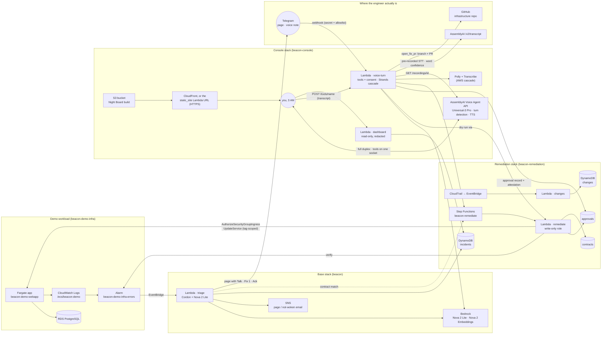
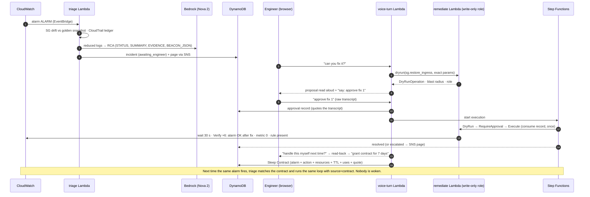
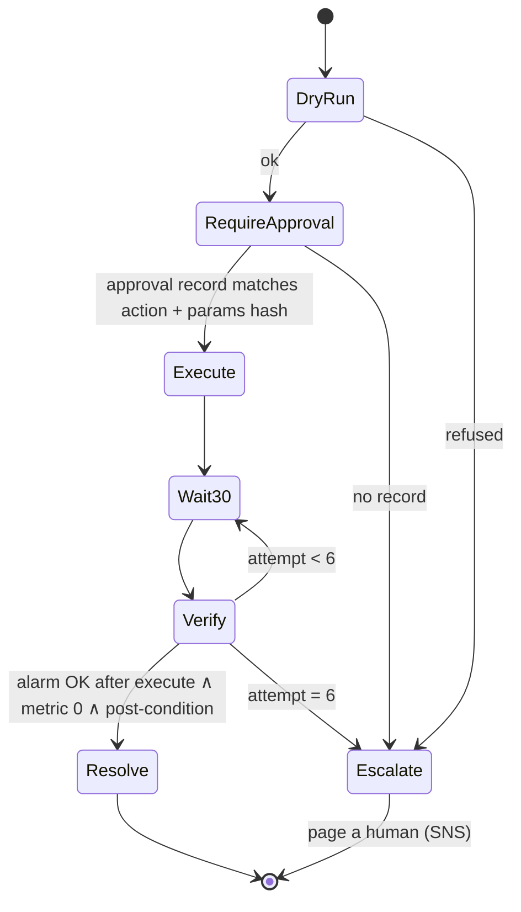

# Architecture

Three CloudFormation stacks plus the demo workload. Every arrow below is a real integration in the account; the names are the resources' names.

## The system

## One incident, end to end

## The verified remediation loop

## Trust boundaries

| Role | May | May not |
|---|---|---|
| triage (`beacon-*`) | read logs/metrics/alarms, Bedrock, write incidents, start the state machine | any EC2/ECS/RDS write |
| voice-turn | everything the engineer can see, invoke `remediate` for dry runs, write approval records, start the state machine, STS for the mic | any EC2/ECS/RDS write |
| dashboard | read tables (redacted), revoke a contract | anything else |
| remediator | `ec2:AuthorizeSecurityGroupIngress` and `ecs:UpdateService` on resources tagged `beacon:remediable=true` (+ the untaggable `security-group-rule/*`), verify reads | anything else |

`tests/test_template_safety.py` parses the templates and fails if this table stops being true.
